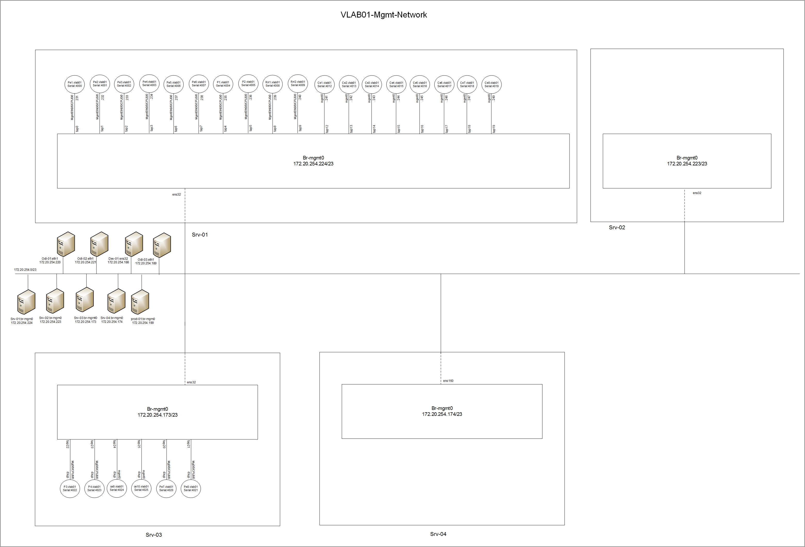
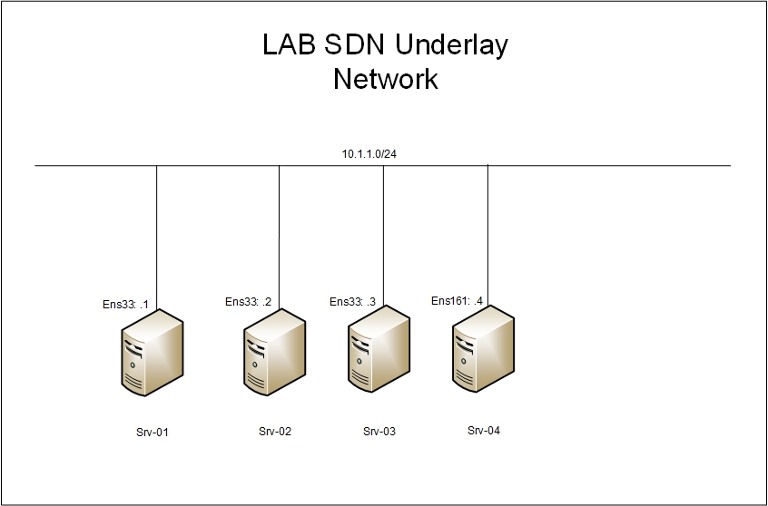
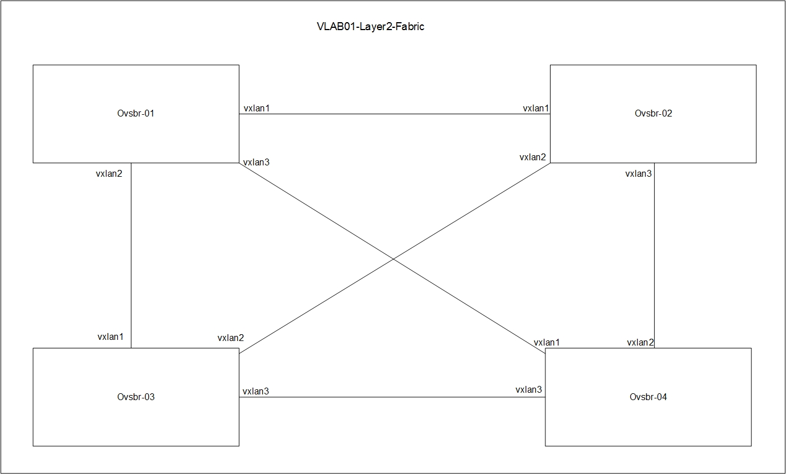
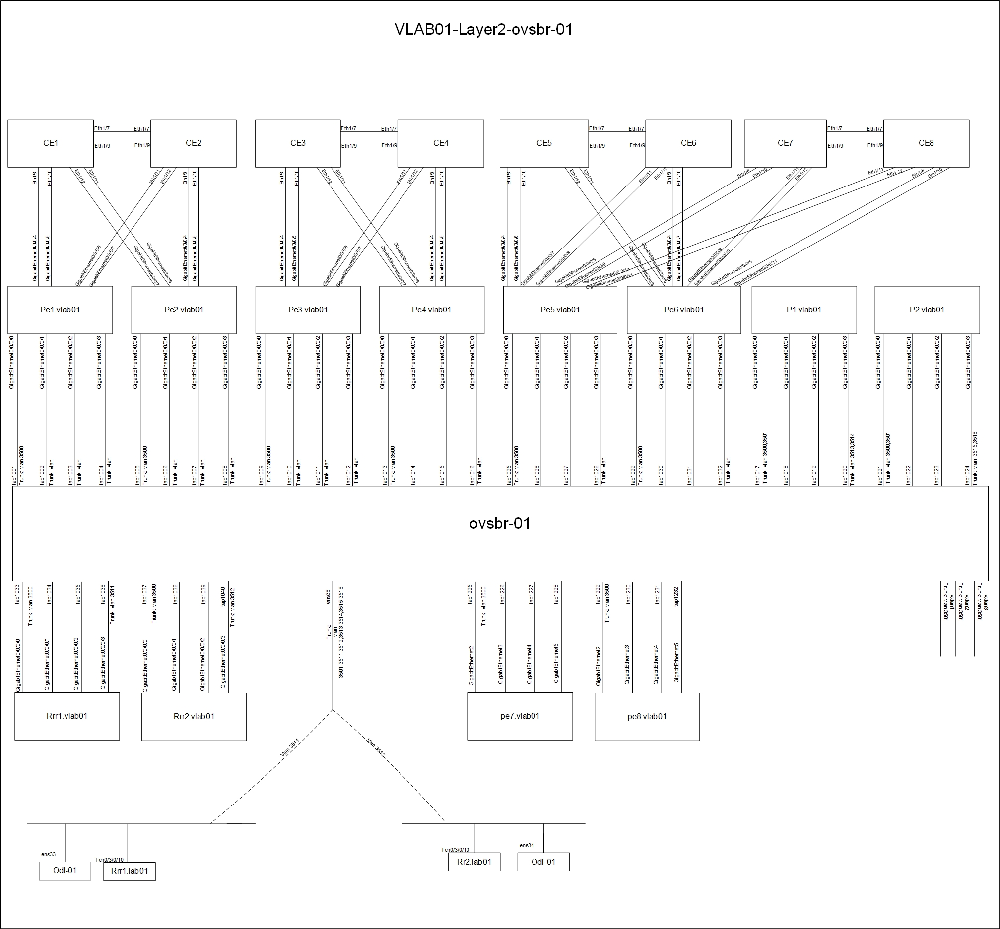
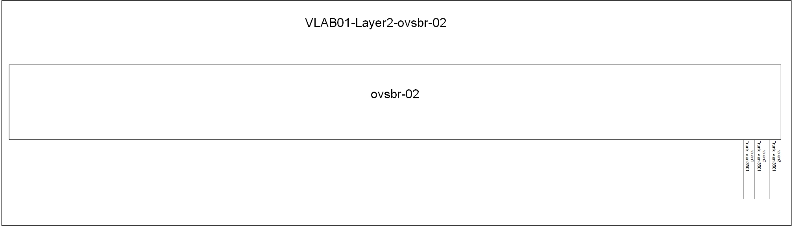
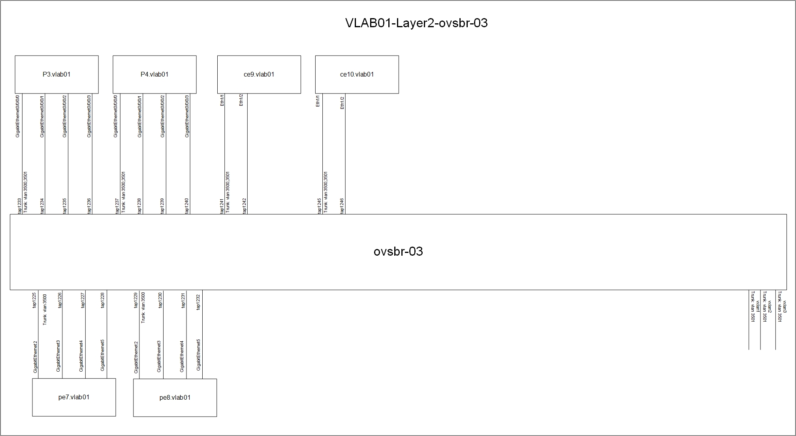
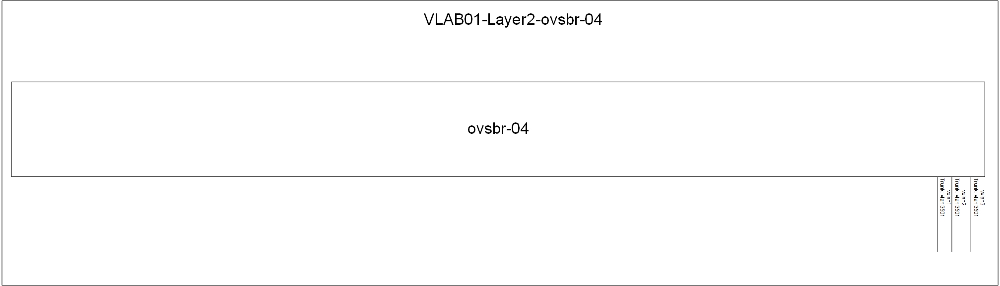
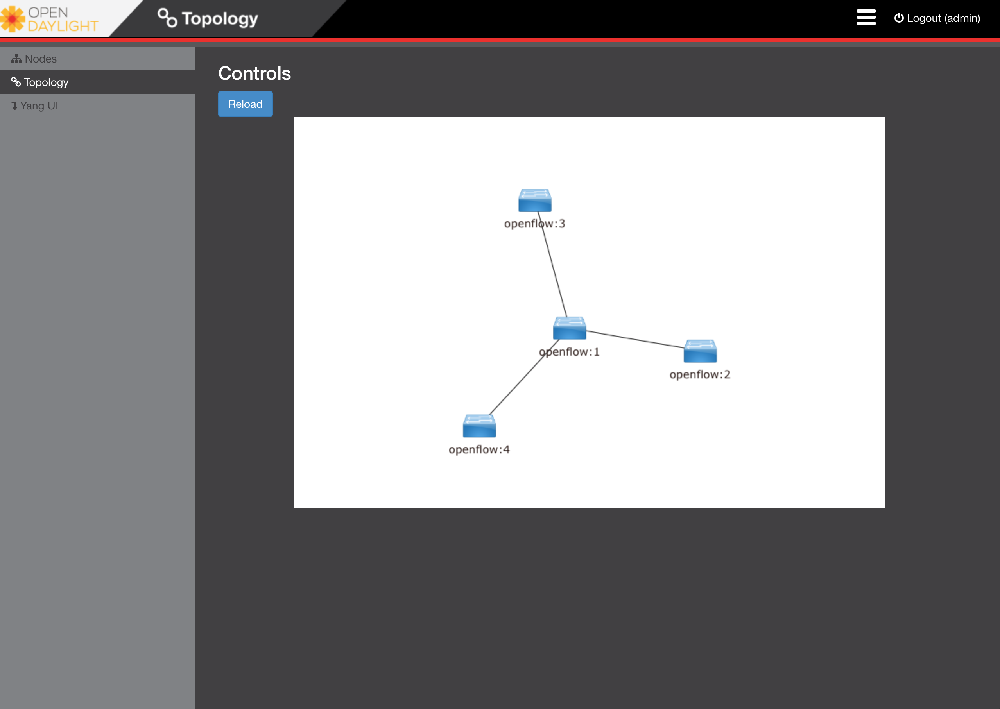

# OpenDaylight Open vSwitch Layer 2 Virtual Lab

A public lab reference for building an OpenDaylight-managed Open vSwitch Layer 2 topology with QEMU, TAP interfaces, VXLAN, L2TPv3, and RESTCONF.

## Value Proposition

This lab shows how a software-defined networking controller can build and operate a multi-host Open vSwitch Layer 2 topology without dedicated physical switching hardware. It combines OpenDaylight, Open vSwitch, QEMU, VXLAN, L2TPv3, and RESTCONF automation to show how network teams can prototype virtual Layer 2 fabrics, validate controller workflows, and explain SDN concepts in a repeatable lab environment.

The lab is designed for workshops, proof-of-concept discussions, and public reference review where the audience needs to understand what the controller is doing, how the virtual devices are connected, and why the design matters.

The backend design pattern is similar to modern GUI-based network emulation platforms such as [EVE-NG](https://www.eve-ng.net/): Linux/KVM hosts, QEMU-based network appliances, TAP interfaces, software switching, and overlay connectivity. This implementation keeps the workflow script-driven and controller-aware so the audience can see how the Open vSwitch Layer 2 topology is assembled from first principles.

## Background

Originally built as a 2018 proof of concept, this folder preserves the architecture and command patterns while replacing internal values, credentials, and environment-specific details. The original context is preserved as provenance; these examples are not production deployment guidance.

The repository preserves useful historical implementation context while separating it from the public reference narrative. Historical build logs remain available under `docs/build-logs/`; the README is the recommended starting point for a new audience.

## Capabilities

- Controller-driven Open vSwitch bridge creation through OpenDaylight.
- OVSDB and OpenFlow integration between OpenDaylight and host switches.
- Layer 2 extension across multiple Ubuntu hosts using VXLAN.
- Virtual device connectivity using QEMU TAP interfaces and UDP L2TPv3 tunnels.
- RESTCONF-based automation using Postman collections.
- Visual validation of the resulting Layer 2 topology in the OpenDaylight DLUX GUI.

## POC00 Use Cases

POC00 shows how a virtual lab network can be built programmatically so teams can create repeatable, disposable SDN environments. Common use cases include:

- Building isolated proof-of-concept environments for OpenDaylight and Open vSwitch workflows.
- Recreating the same virtual Layer 2 topology across workshops, examples, and test runs.
- Practicing infrastructure automation with RESTCONF, OpenFlow, OVSDB, VXLAN, TAP interfaces, and QEMU.
- Testing network segmentation, overlay connectivity, and controller-driven bridge configuration before applying similar patterns elsewhere.
- Simulating multi-host switching behavior without dedicated physical switching hardware.
- Supporting cybersecurity labs, network engineering training, and hands-on SDN education.
- Validating topology discovery, LLDP behavior, and loop-free Layer 2 forwarding in a controlled lab.
- Preserving infrastructure design as version-controlled documentation and executable setup references.

## Audience

This repo is intended for network engineers, systems engineers, architects, and lab builders who want a concrete example of SDN-driven Open vSwitch Layer 2 topology setup. It is especially useful for audiences that understand switching concepts but have not seen how an SDN controller, software switches, Linux/KVM hosts, and emulated network appliances can be assembled into a repeatable lab environment.

## Audience Takeaway

After reviewing the workflow, the audience should be able to explain:

- How OpenDaylight manages Open vSwitch bridges on remote hosts.
- How the underlay, overlay, and virtual device layers fit together.
- How RESTCONF calls translate into bridge, port, and flow configuration.
- How virtual devices can be interconnected for realistic lab testing.
- How the controller discovers and displays a loop-free Layer 2 topology.

## Architecture Overview

The lab uses four Ubuntu hosts with hardware virtualization support, one production/control host, one development host, and three OpenDaylight containers.

| Component | Role |
| --- | --- |
| `srv-01` to `srv-04` | Ubuntu QEMU hosts that provide virtual device attachment points. |
| `prod-01` | Hosts the OpenDaylight controller containers. |
| `dev-01` | Development and test system. |
| `odl-01` | Primary OpenDaylight controller for OVSDB, OpenFlow, and topology management. |
| `odl-02` | Additional OpenDaylight controller container from the original lab build. |
| `odl-03` | Additional OpenDaylight controller container from the original lab build. |
| Virtual devices | QEMU-based lab appliances connected through management, TAP, and tunnel interfaces. |

## How the Lab Works

The Ubuntu hosts register with OpenDaylight as OVSDB nodes when they start. OpenDaylight then creates Open vSwitch bridges on the hosts and attaches TAP, Ethernet, and VXLAN interfaces as bridge ports.

VXLAN tunnels extend Layer 2 connectivity between hosts. The Open vSwitch bridges form a fully meshed Layer 2 fabric, with STP enabled to prevent forwarding loops. OpenFlow rules are pushed to the bridges to enable switching and forward LLDP frames to the controller.

Virtual devices run in QEMU. Their management interfaces are connected to a regular Linux bridge, while their data interfaces are connected through TAP interfaces or UDP L2TPv3 tunnels:

- TAP-backed interfaces connect virtual devices to Open vSwitch bridges.
- L2TPv3-backed interfaces create direct point-to-point links between virtual devices.

## Prerequisites

- Four Ubuntu/KVM-capable lab hosts, or equivalent virtual hosts with nested virtualization where required.
- One Docker-capable host for the OpenDaylight controller containers.
- QEMU/KVM, Open vSwitch, Linux bridge tooling, `curl`, and Postman or a compatible REST client.
- Properly licensed network operating system images for any virtual devices referenced by the scripts.
- Local adjustments for hostnames, private IP addresses, TAP names, MAC addresses, tunnel values, and `/home/lab/BBLAB` paths.

## Workflow Overview

1. Start with the management network and show how the hosts, controllers, and virtual devices are reachable.
2. Explain the underlay network used by the Ubuntu hosts.
3. Show how OpenDaylight sees the hosts as OVSDB nodes.
4. Use RESTCONF calls from the virtual lab foundation Postman collection to create Open vSwitch bridges and trunk ports.
5. Add VXLAN ports to extend Layer 2 between hosts.
6. Push OpenFlow rules for switching and LLDP forwarding.
7. Launch the QEMU-based virtual devices.
8. Open the OpenDaylight DLUX GUI and show the discovered loop-free Layer 2 topology.

OpenDaylight DLUX GUI:

```text
http://odl-01:8181/index.html
```

## Automation

The included Postman collection contains the RESTCONF calls used to build the Open vSwitch Layer 2 topology:

```text
opendaylight-virtual-network-lab.postman_collection.json
```

The included foundation API calls perform three primary tasks:

1. Change the LLDP Ethernet frame destination MAC address in OpenDaylight.
2. Create OpenFlow bridges and trunk ports.
3. Push OpenFlow rules to Open vSwitch bridges for switching and LLDP forwarding.

## Lab Diagrams

### Management Network



### Underlay Network



### Layer 2 Fabric



### Open vSwitch Bridges









### Loop-Free Layer 2 Topology



## Glossary

| Term | Meaning |
| --- | --- |
| OpenDaylight | SDN controller used to manage topology, OpenFlow, OVSDB, and RESTCONF workflows in this lab. |
| Open vSwitch | Software switch used on the Ubuntu hosts. |
| OVSDB | Management protocol used by OpenDaylight to configure Open vSwitch. |
| OpenFlow | Southbound protocol used to program forwarding behavior. |
| VXLAN | Overlay tunneling technology used to extend Layer 2 between hosts. |
| TAP interface | Virtual network interface used by QEMU to connect virtual devices to the host network. |
| L2TPv3 | Tunnel mechanism used here for direct virtual point-to-point links. |
| RESTCONF | HTTP-based API used to configure and query OpenDaylight. |

## Sanitization Notes

This repository is prepared as a public-facing lab reference. It does not include proprietary network operating system images, VM disk images, private keys, certificates, environment files, or controller credentials.

The Cisco IOS XRv, NX-OSv, and CSR1000v names in the scripts and diagrams identify virtual network operating systems used by the original lab. They are referenced only as example guest appliances for the Open vSwitch Layer 2 topology workflow. Users must supply their own properly licensed vendor images and update the script paths for their environment.

The private IP addresses, hostnames, MAC addresses, TAP names, and `/home/lab/BBLAB` paths are example lab values. Treat them as implementation references, not production configuration. The Postman collection uses the `odl_basic_auth` variable for RESTCONF authentication so credentials can be set locally and kept out of source control.

## Private Lab Replacement Notes

Before using the files in a private lab, replace hostnames, private addressing,
MAC addresses, TAP names, VXLAN and L2TPv3 values, `/home/lab/BBLAB` paths,
controller credentials, and virtual disk filenames. Supply properly licensed
network operating system images outside this repository.

## Supporting Files

| Path | Purpose |
| --- | --- |
| `Scripts/` | Host scripts for TAP interface handling and virtual device startup. |
| `Dockerfile/` | Docker build files for OpenDaylight controller containers. |
| `opendaylight-virtual-network-lab.postman_collection.json` | RESTCONF request collection used to build the OpenDaylight-managed Open vSwitch Layer 2 topology. |
| `Variables.txt` | Port, TAP, MAC address, and tunnel allocation reference. |
| `docs/build-logs/` | Historical host and controller build notes. |

